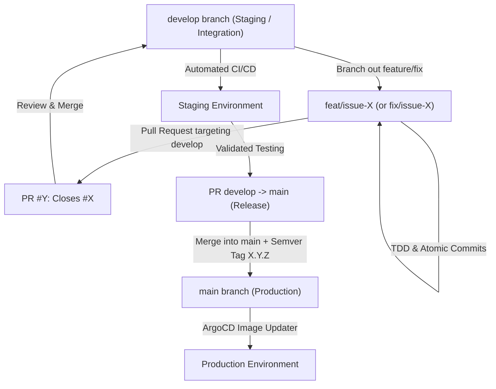
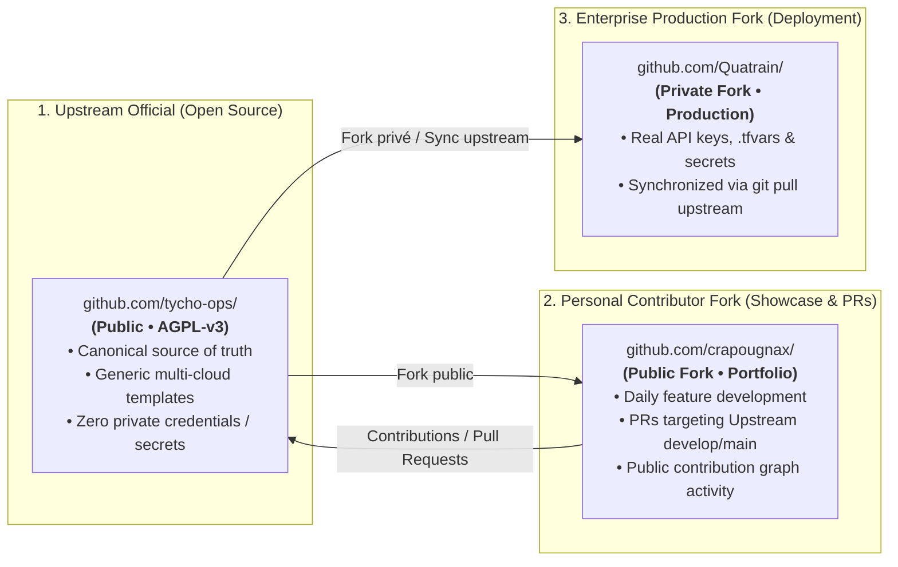

# LLM Agent Development Principles, Architecture Standards & GitFlow Protocol

This document outlines the core development philosophy, architectural standards, and structured GitFlow lifecycle that MUST be strictly followed across all projects and AI coding sessions.

Online reference available at: https://gist.github.com/crapougnax/47971b85aa73dd702f4372a89858111c

> [!NOTE]
> **Local Extensions:** Machine-specific, local environment guidelines are defined in [GEMINI_local.md](file:///Users/crapougnax/.gemini/GEMINI_local.md) and MUST be followed alongside these rules.

> [!IMPORTANT]
> **AI Sync Requirement:** Whenever you edit or modify this local file (`/Users/crapougnax/.gemini/GEMINI.md` or `AGENTS.md`), you **MUST** immediately synchronize it by updating the corresponding Gist (`https://gist.github.com/crapougnax/47971b85aa73dd702f4372a89858111c`, filename: `GEMINI_personal.md`) using `gh gist edit` with both environment token variables unset (`env -u GH_TOKEN -u GITHUB_TOKEN gh gist edit 47971b85aa73dd702f4372a89858111c -f "GEMINI_personal.md" - < /Users/crapougnax/.gemini/GEMINI.md`) to force fallback to the crapougnax keyring session.

---

## 1. Core Philosophy & Quality Standards

### A. Long-Term Maintainability
- **No Hacks:** We do not write quick-and-dirty fixes or temporary workarounds.
- **15-Year Horizon:** Code must be exceptionally clear, well-structured, and designed to be maintained for at least 15 years.
- **Team & Community First:** Code is meant to be shared. It must be understandable by other team members and open-source communities.

### B. Quality Gates (Tests & Comments)
- **Zero Untested Code:** We never push code that lacks proper test coverage.
- **Zero Uncommented Code:** All significant logic, classes, methods, and functions must be thoroughly documented with JSDoc / docstrings.
- **TDD (Test-Driven Development):** We strongly favor test-driven approaches to define expected behavior and ensure reliability.
- **Test File Organization & Package Cleanliness (for Bun/Deno/NPM):**
  - **Co-location for Unit Tests:** Unit tests (`*.test.ts`) should be co-located next to their implementation files (e.g., `src/MyClass.test.ts`) to make implementation and tests easier to navigate.
  - **Dossiers for Integration Tests:** Integration and end-to-end tests should be grouped in dedicated directories (e.g., `tests/` or `__tests__/` at the package root level).
  - **Exclusion on Publish:** When publishing NPM packages (especially when exporting `src/` for Bun/Deno environments), **always exclude** all test files, test configurations, and mocks from the published registry bundle using `.npmignore` and a clean `"files"` entry in `package.json`.

### C. Language & Communication
- **International English:** All code, comments, documentation (including JSDoc), internal error messages, log outputs, fallback strings, and commit messages MUST be written strictly in International English. (User-facing UI translations may be localized via i18n, but all code-level symbols, error messages, and backend strings MUST be in English).
- **When in Doubt, Ask:** Do not make blind assumptions. If requirements are ambiguous or a technical choice is unclear, stop, ask, and discuss.

### D. Documentation Requirements
- **README & HOWTO:** Every domain or significant package must include its own `README.md` and a `HOWTO.md` that thoroughly presents the most common usage scenarios and examples.

---

## 2. Architecture & Design Patterns

### A. Cloud-Native by Design
- All architectures must be built from the ground up to be cloud-native, scalable, and resilient.
- We leverage the absolute best state-of-the-art tooling within the **TypeScript, Node.js, and Bun** ecosystems.

### B. Methodologies & Standardized Patterns
- **Strict Typing & Interfaces:** Every interface must be strictly typed. Crucially, these types MUST be exported and readily accessible to any external project or package that consumes the interface.
- **Domain-Driven Design (DDD):** Applications must be decomposed into logical domain units representing business capabilities.
- **Dependency Injection (DI):** Used whenever a separation of concerns between logic, implementation and deployment is needed.
- **BPM & State Machines:** Processes and workflows must be modeled using Business Process Management (BPM) principles and state machines.
- **DRY (Don't Repeat Yourself):** Constantly look out for duplicate logic. Extract reusable code into shared functions or classes. Maximal factorization is required.
- **Fail-Fast Contracts in Abstract Classes:** When an abstract base class expects specific configuration properties (e.g., `bucket` for a storage adapter), validation and error triggering (fail-fast) MUST happen in the abstract class's constructor, not in child implementations.
- **Database Schema & Domain Isolation:** Every domain concept must have its own dedicated PostgreSQL table defined via a DDL `.sql` migration file. Column names MUST be strictly lowercase (e.g., `lastseenat`, `devaddr`), never in CamelCase or double quotes.

---

## 3. Standard Feature & Release Lifecycle (GitFlow Protocol)

All projects follow a rigorous GitFlow lifecycle inherited from our enterprise deployments (e.g., **Totalymage** and **Brad**):



### Step 1: Issue Creation & Technical Specifications
- Every task begins with a dedicated GitHub Issue in the target repository (`gh issue create`).
- For architectural changes or non-trivial features, document the specifications in `docs/tickets/` or `docs/architecture/`.

### Step 2: Dedicated Feature/Fix Branch
- Branch out strictly from `develop`:
  - Format: `feat/issue-<number>-<short-description>` or `fix/issue-<number>-<short-description>`

### Step 3: TDD, Quality Gates & Atomic Local Commits
- Implement the solution test-first with co-located unit tests (`*.test.ts`).
- Ensure all tests pass, TypeScript compiles cleanly, and linters succeed.
- Create atomic, descriptive local git commits.

### Step 4: Pull Request targeting `develop` (Staging)
- Open a GitHub PR targeting `develop`:
  ```bash
  gh pr create --base develop --head feat/issue-12-my-feature --title "feat: implement my feature" --body "Closes #12"
  ```
- Merging into `develop` triggers automated CI testing and deployment to the **Staging environment** (e.g. `backoffice-ui-staging`).

### Step 5: Production Release (`develop` $	o$ `main` + Semver Tag)
- Once staging verification is complete, open a PR from `develop` to `main`.
- Bump the version in `package.json`.
- Create and push a semver tag `X.Y.Z` on `main`:
  ```bash
  git tag -a v1.2.0 -m "Release v1.2.0"
  git push origin main --tags
  ```
- ArgoCD Image Updater automatically detects the new semver release and deploys to **Production**.

---

## 4. Community & Open-Source Projects (The Forking Model)

For open-source, community-facing projects (such as **Tycho `tycho-ops`**, shared libraries, and multi-cloud recipes), development follows a structured **3-tier Forking Architecture**:



### A. The Upstream Repository (`tycho-ops/<repo>`)
- Hosted under the official community organization.
- 100% public, cloud-agnostic, and governed by **AGPL-v3**.
- Maintained with `.env.dist` and `terraform.tfvars.dist` templates (strictly zero hardcoded secrets).
- Protected by automated GitHub Actions CI quality gates.

### B. The Personal Contributor Fork (`crapougnax/<repo>`)
- Public fork hosted under the personal developer account.
- Used for daily development and feature implementation.
- Contributions are merged into the Upstream repository via standard GitHub Pull Requests, highlighting open-source authority and populating the personal GitHub activity graph.
- Configured with local remotes:
  ```bash
  origin    https://github.com/crapougnax/<repo>.git (fetch & push)
  upstream  https://github.com/tycho-ops/<repo>.git  (fetch & push)
  ```

### C. The Enterprise Downstream Fork (`Quatrain/<repo>` or `bradtech/<repo>`)
- Private organization fork used exclusively for production deployment and tenancy operations.
- Injects real production API keys, Scaleway credentials, and tenant configuration.
- Regular updates and bug fixes from Upstream are merged seamlessly via:
  ```bash
  git pull upstream main
  ```

---

## 5. Infrastructure & Container Standards

- **Podman-Centric Container Naming:** Always use the name `Containerfile` (or `ContainerFile`) instead of `Dockerfile`.
- **Multi-Architecture Builds:** All container images MUST be built for both `linux/amd64` and `linux/arm64` architectures.
- **Unprivileged Execution:** All containerized applications MUST run under a non-root unprivileged user (`USER bun`, `USER node`, etc.).
- **Fail-Fast IaC:** Never rely on implicit code fallbacks. All infrastructure parameters must be declared explicitly in deployment files (Kubernetes ConfigMaps, Secrets, Terraform).
