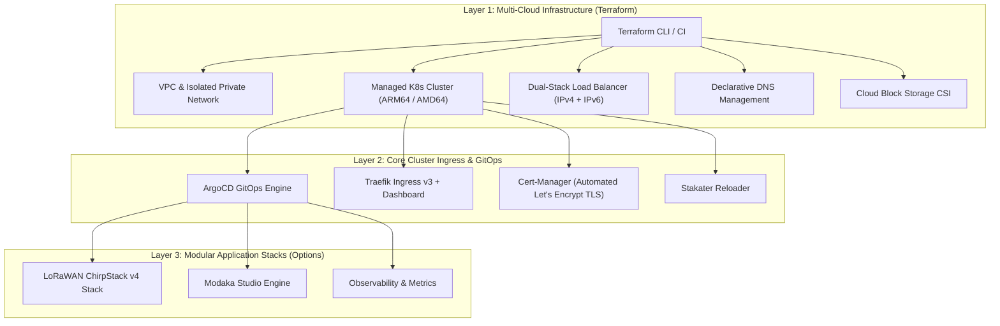

# Tycho Kubernetes IaC & GitOps Recipes (`k8s-iac`)

[](https://www.gnu.org/licenses/agpl-3.0)
[](https://kubernetes.io/)
[](https://traefik.io/)
[](https://argoproj.github.io/cd/)
[](https://www.terraform.io/)
[](#)

Production-grade, cloud-agnostic **Kubernetes Infrastructure as Code (IaC)** and **GitOps deployment recipes** by **[Tycho](https://github.com/tycho-ops)**.

Designed for high availability, zero-friction automated Let's Encrypt TLS issuance, cloud-native storage persistence, and modular application workload management.

---

## 🏗️ Architecture & Philosophy



---

## ✨ Key Capabilities

- 🚀 **1-Click Cluster Ingress & TLS Bootstrap**: Provision Traefik v3, native IngressClass, Cert-Manager v1.16, ClusterIssuer HTTP-01, and production certificates in a single non-blocking command.
- 🔒 **1-Command SSL Certificate Issuer**: Seamlessly generate valid Let's Encrypt certificates for any subdomain with `tycho k8s cert`.
- 🌐 **Cloud-Agnostic Modules**: Reusable Terraform modules for Scaleway (Kapsule ARM64, SBS Block Storage, Flexible IPs) and extensible to Hetzner, AWS, and bare-metal.
- 🧩 **Modular Workload Stacks**: Enable or disable application suites (such as LoRaWAN ChirpStack v4 with PostgreSQL 16 persistence, Redis 7, Mosquitto MQTT, and LoRa Basics™ Station WSS) on demand.
- 🐙 **GitOps Driven (ArgoCD)**: Declarative drift detection, auto-healing, and App-of-Apps management pattern.

---

## ⚡ Quick Start

### 1. Provision Cloud Infrastructure (Scaleway Example)
```bash
cd terraform/environments/scaleway-production
cp terraform.tfvars.dist terraform.tfvars
# Edit terraform.tfvars with your project ID and domain
terraform init
terraform apply
```

### 2. Configure Kubeconfig
```bash
export KUBECONFIG=~/.kube/config-production.yaml
kubectl get nodes -o wide
```

### 3. Bootstrap Ingress, Traefik & TLS
```bash
tycho k8s bootstrap
# or ./bin/tycho-k8s bootstrap
```

### 4. Deploy Optional Workload Stacks (LoRaWAN Example)
```bash
tycho k8s deploy lorawan
# or ./bin/tycho-k8s deploy lorawan
```

---

## 📖 Comprehensive Documentation

For end-to-end tutorials, dashboard access credentials setup, certificate troubleshooting, and multi-cloud extension guides, see:
👉 **[HOWTO.md](HOWTO.md)**

---

## 📜 License

GNU Affero General Public License v3.0 (**AGPL-v3**). See [LICENSE](LICENSE) for details.
